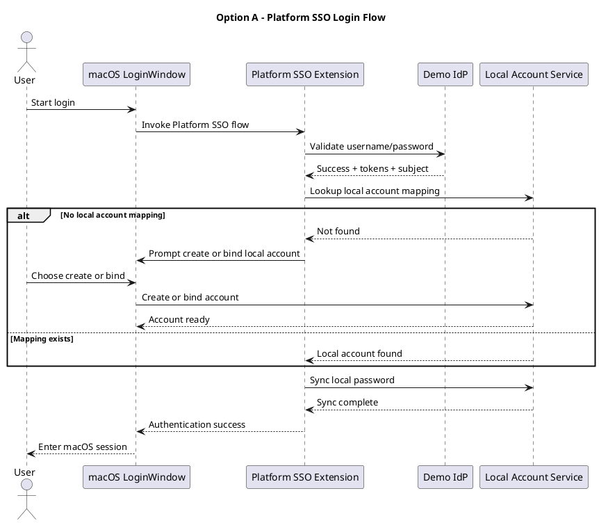
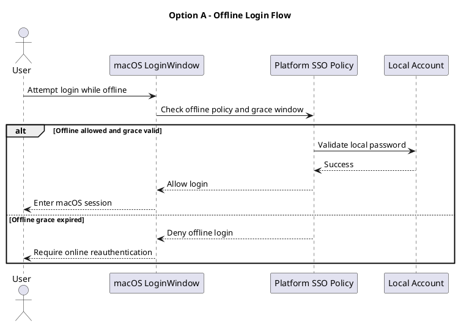
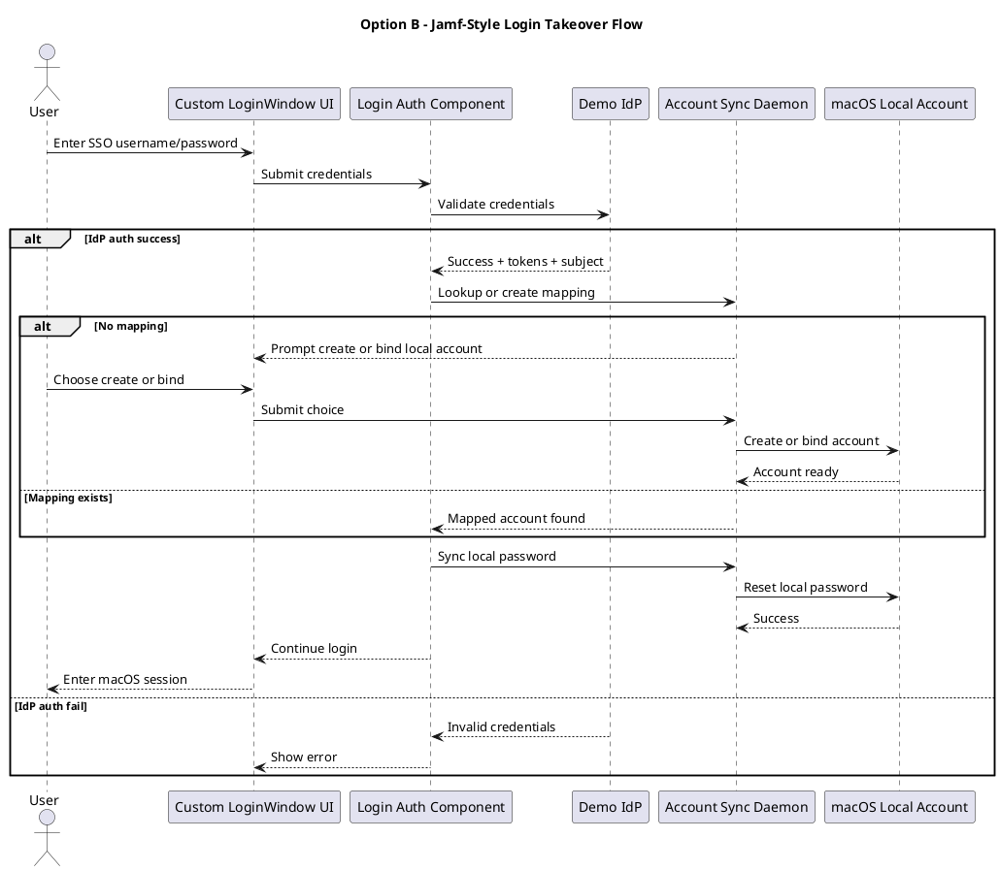
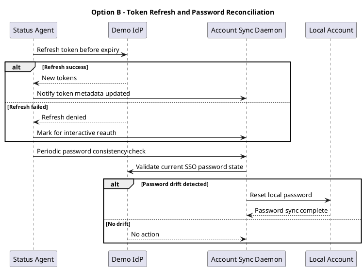

# macOS LoginWindow SSO Demo Design

Status: Draft for review
Date: 2026-03-09

## Goal

Design two demo implementation paths for validating SSO-based macOS login:

1. Apple-official path based on Platform SSO and Extensible SSO
2. Jamf Connect-style path based on LoginWindow authentication takeover

The decision after review is which path to implement in this repository.

## Source Basis

This design is based on:

- Apple Platform Deployment documentation for Platform SSO and Extensible SSO
- Apple Platform Security documentation for Platform SSO behavior
- Jamf public documentation for Jamf Connect and `authchanger`
- Local notes from `gpt-chat.md`

Primary references:

- Apple Platform SSO overview: https://support.apple.com/en-asia/guide/deployment/dep7bbb05313/web
- Apple Extensible SSO payload settings: https://support.apple.com/guide/deployment/extensible-single-sign-on-payload-settings-depfd9cdf845/web
- Apple Platform Security, Platform SSO for macOS: https://support.apple.com/en-lamr/guide/security/sec0c87ccc6d/web
- Jamf `authchanger and Jamf Connect`: https://support.jamf.com/en/articles/11003602-authchanger-and-jamf-connect
- Jamf Connect configuration concepts: https://learn.jamf.com/en-US/bundle/jamf-connect-documentation-current/page/Configuration.html

## Requirement Breakdown

The requested demo needs to validate these user-facing behaviors:

1. At macOS login time, present SSO-based authentication instead of relying only on the local password.
2. Validate credentials against an SSO IdP service. For the demo, the IdP can use a fixed account and password.
3. Support offline login.
4. Periodically:
   - refresh SSO tokens before or when expired
   - detect whether the IdP password differs from the local password and sync the local password
5. Provide an uninstall path.

There is an important requirement split:

- "Looks like Jamf Connect" means takeover of the login experience.
- "Close to Apple official capability" means Platform SSO.

Those are not the same technical path.

## Option A: Apple Official Path

### Summary

Use a host app that contains an Extensible SSO / Platform SSO-capable extension, deploy it with configuration profiles through MDM, and let macOS handle account binding, login policy, password sync, and token lifecycle where the OS supports it.

### Why this is the official path

Apple's current enterprise identity integration strategy is centered on Platform SSO. Apple documents these capabilities directly:

- account creation at login
- local account authentication using an IdP-backed login flow
- password synchronization
- offline grace policies
- token refresh behavior

### Version boundary

Platform SSO is not a single-version feature for all needed behaviors.

Practical version matrix for this demo:

| Capability | Apple-documented floor |
| --- | --- |
| Platform SSO base support | macOS 13 |
| On-demand local account creation | macOS 14 |
| Login policies and offline grace period controls | macOS 15 |
| Setup Assistant / ADE style enrollment-first login integration | documented by Apple as newer rollout, not suitable as the initial demo assumption |

Conclusion:

- If the goal is only "Platform SSO exists", macOS 13 is enough.
- If the goal is "create or bind local account during login", use macOS 14+.
- If the goal is "offline policy and richer login control", use macOS 15+.
- For the requested feature set, the realistic demo target should be macOS 15+.

### MDM dependency

This path assumes a managed device.

The design depends on:

- installing the host app containing the SSO extension
- deploying Extensible SSO / Platform SSO configuration payloads
- enabling the identity provider settings through MDM-managed profiles

This is the clearest functional difference versus a Jamf Connect-style path.

### Intended demo architecture

Outputs:

1. `DemoSSOHost.app`
   - signed macOS app that contains the SSO extension
   - provides status UI, logs, and uninstall entry point
2. `DemoPlatformSSOExtension.appex`
   - implements the extension-side identity logic
   - talks to the demo IdP
3. `demo-idp-server`
   - local demo IdP service with fixed credentials and simple token issuance
4. `profiles/`
   - MDM payload examples for Extensible SSO / Platform SSO
5. `scripts/`
   - install helpers for local lab testing
   - uninstall helpers that remove app and payload artifacts

### Demo authentication model

Use a minimal fixed account for the IdP:

- Username: `demo.user`
- Password: `DemoPass123!`

The IdP server issues:

- access token
- refresh token
- token expiry metadata
- stable subject identifier

For the demo, the IdP can remain intentionally simple:

- one hard-coded user
- one tenant
- simple local token persistence
- no federation to an external cloud IdP

### Login-time behavior

Target flow:

1. User reaches macOS login.
2. Platform SSO invokes the IdP-backed login flow.
3. Extension validates the credentials with the demo IdP.
4. If there is no matching local account:
   - create a new local account, or
   - bind to an existing local account selected by the user
5. Synchronize local password to the IdP password.
6. Ensure SecureToken handoff or enrollment path for FileVault-capable login.

Important note:

For this option, account creation, password sync, and offline policy should be modeled as much as possible using OS-provided Platform SSO behavior rather than custom root daemons. If the demo hits gaps in local lab conditions, we can add a small privileged helper only for environment setup and observability.

### Offline login design

Use the official model:

- rely on Platform SSO login policies and offline grace period
- allow offline login only after at least one successful online authentication
- cache identity binding metadata locally
- continue allowing local password login within a configured grace window
- force online revalidation after grace expiry

Recommended demo policy:

- offline allowed after one successful online login
- offline grace period: 7 days
- break-glass local admin excluded from SSO control

### Token refresh design

Use Platform SSO lifecycle where possible.

Apple documents token refresh attempts when:

- tokens are missing
- tokens are expired
- tokens are older than four hours

Demo behavior:

- extension exposes refresh capability to the OS flow
- host app provides log visibility
- local monitoring UI shows current token age and last refresh time

### Password consistency design

Use OS-managed synchronization where supported.

The intended behavior is:

1. user password changes at IdP
2. next login or periodic identity check detects mismatch
3. local password is synchronized to match the IdP

For demo visibility, the host app should surface:

- last password sync time
- last mismatch detection result
- current local account binding

### SecureToken and FileVault

This area is the highest operational risk.

For the demo:

- initial scope should assume a lab machine with FileVault either disabled or handled in a post-binding validation step
- if SecureToken enablement is included, treat it as a separate validation slice
- do not make FileVault unlock the first milestone for Option A

Reason:

Platform SSO can participate in login policy and account creation, but full FileVault-first experience is environment-sensitive and should not be the first proof point in an empty repo demo.

### Uninstall path

Provide two entry points:

1. host app UI action: "Uninstall Demo SSO Login"
2. CLI script: `scripts/uninstall-platform-sso-demo.sh`

Uninstall should:

- remove the host app
- remove extension-related artifacts
- remove MDM profile in a lab-only non-managed path or document that true managed removal must happen through MDM
- restore ordinary login behavior by removing the deployed configuration

### Required materials

- Apple Developer account and code-signing identities
- macOS 15+ lab device
- test admin account
- optional MDM lab tenant
- entitlement-capable build and signing setup
- demo IdP service runtime

### Risks

- stronger signing, entitlement, and profile requirements
- requires managed-device assumptions
- local development feedback loop is slower
- some experiences depend on macOS version-specific behavior

## Option B: Jamf Connect-Style Path

### Summary

Build a login takeover path that mimics the Jamf Connect model: replace or alter the login authentication chain used by `loginwindow`, present a custom login UI, validate against a demo IdP, then create or bind a local account and synchronize the password.

### Why this path exists

Jamf documents that `authchanger` changes the authentication database used by the macOS `loginwindow` application. That is strong evidence that the Jamf Connect-style experience is built by modifying the login authentication chain rather than relying only on Platform SSO.

### Version boundary

Jamf public materials position Jamf Connect for broad deployment on macOS 11 and later. Jamf configuration materials also show configuration can be saved as a local plist or as a `.mobileconfig`, which means the product path is not inherently dependent on MDM enrollment.

Conclusion:

- this path is suitable if the key business requirement is macOS 11+
- this path is also suitable if the lab must work without MDM

### MDM dependency

MDM is optional, not mandatory.

Possible deployment modes:

- local package install by an admin
- local plist configuration
- locally installed `.mobileconfig`
- MDM-distributed configuration as a later operational convenience

### Intended demo architecture

Outputs:

1. `DemoLoginWindow.bundle`
   - login authentication mechanism or equivalent takeover component
2. `DemoLoginUI.app` or embedded UI component
   - native login UI for username, password, account selection, and account creation choice
3. `demo-idp-server`
   - fixed-credential validation service
4. `DemoAccountSyncDaemon`
   - root daemon for local account creation, password sync, SecureToken work, and periodic reconciliation
5. `DemoSSOStatusAgent`
   - user-session agent for token refresh status and observability
6. `scripts/`
   - install, enable, disable, and uninstall helpers

### Demo authentication model

Use the same minimal fixed account:

- Username: `demo.user`
- Password: `DemoPass123!`

Behavior:

1. Login UI collects credentials.
2. Login component sends them to the demo IdP.
3. If valid:
   - discover whether a mapped local user already exists
   - if no mapping exists, show:
     - bind to existing local user
     - create new local user
4. Synchronize local password.
5. Continue macOS login using the local account.

### Account binding model

Store a local mapping record:

- SSO subject
- local short name
- last online auth time
- last token refresh time
- offline grace expiry

Suggested storage:

- root-owned plist or JSON under `/Library/Application Support/DemoSSO/`

### Offline login design

This path cannot rely on Apple Platform SSO policy controls, so the demo must implement its own policy.

Recommended design:

1. Allow offline login only for a user who has completed at least one successful online login.
2. Validate against the last synchronized local password instead of remote IdP.
3. Enforce an offline grace period from local metadata.
4. Deny offline login after grace expiry and require online reauthentication.
5. Keep one break-glass local admin outside the SSO flow.

Recommended demo policy:

- offline grace period: 7 days
- cache only what is needed for policy evaluation
- do not cache raw IdP passwords

### Token refresh design

This must be application-managed.

Recommended split:

- `DemoSSOStatusAgent` refreshes tokens in the user session
- `DemoAccountSyncDaemon` performs privileged follow-up when password drift is detected

Logic:

1. check token expiry every 15 minutes
2. if token expires within 10 minutes, refresh
3. if refresh fails because the refresh token is invalid, mark the user for reauthentication at next login

### Password consistency design

Recommended design:

1. on each successful online login, compare IdP password generation marker with local sync metadata
2. if mismatch is suspected, rotate the local password to match the IdP password
3. also run a periodic background verification every 4 hours when online

Because the demo IdP is hard-coded, the simplest practical mechanism is:

- successful IdP login is treated as proof of the current password
- local password is reset immediately after successful login if needed

### SecureToken and FileVault

This path will likely require a dedicated privileged helper around:

- local account creation
- SecureToken enablement
- post-login password synchronization

For the demo:

- phase 1 should prove account creation and local login without FileVault-first unlock
- phase 2 can add SecureToken enablement for a bound user if the lab machine supports it

### Uninstall path

Provide:

1. UI action: "Restore Native LoginWindow"
2. CLI script: `scripts/uninstall-jamf-style-demo.sh`

Uninstall should:

- disable the custom login takeover
- restore the native authentication chain
- stop and remove daemon and agent
- optionally preserve local account mappings for debugging

If an `authchanger`-style control plane is used, the restore action should mirror the Jamf-documented reset behavior.

### Required materials

- Apple Developer signing setup for macOS binaries
- macOS 11+ lab device
- admin install rights
- demo IdP server runtime
- privileged helper / daemon packaging plan

### Risks

- higher long-term compatibility risk across macOS updates
- more custom privileged code
- likely more sensitive to login-environment limitations
- less aligned with Apple's current enterprise identity direction

This risk assessment is an inference from Apple pushing Platform SSO as the current path and Jamf's documented reliance on login authentication database changes.

## Direct Comparison

| Category | Option A: Platform SSO | Option B: Jamf-style takeover |
| --- | --- | --- |
| Primary goal match | Best for Apple-official validation | Best for Jamf-like experience validation |
| Lowest practical macOS for requested features | macOS 15+ | macOS 11+ |
| MDM required | Yes | No |
| Login experience control | Medium, within Apple framework boundaries | High |
| Alignment with Apple direction | Strong | Weak to medium |
| Time to first lab demo | Slower | Faster if you accept higher custom code |
| Local account creation | OS-assisted | Custom daemon/helper |
| Password sync | OS-assisted where supported | Fully custom |
| Offline login | OS policy-based | Custom policy |
| Token refresh | OS-assisted + extension | Fully custom |
| SecureToken handling | Less custom but still environment-sensitive | More custom and riskier |
| Uninstall | Profile/app removal | Must restore login chain safely |
| Operational risk | MDM and entitlement-heavy | OS-update and privileged-code-heavy |

## Recommendation Matrix

Choose Option A if:

- the real target is modern managed macOS
- the demo is meant to validate Apple-supported enterprise identity integration
- you can tolerate macOS 15+ and MDM-managed assumptions

Choose Option B if:

- you must support macOS 11+
- the lab cannot rely on MDM
- the main goal is reproducing a Jamf Connect-like login takeover experience

## Recommended Decision

If the decision criterion is "closest to Apple's current official architecture", choose Option A.

If the decision criterion is "closest to the Jamf Connect product feel and deployable without MDM", choose Option B.

Given the current requirement wording, both are defensible, but they validate different product questions:

- Option A validates "Can we build an Apple-aligned enterprise SSO login integration?"
- Option B validates "Can we reproduce Jamf Connect-style takeover behavior on older or unmanaged Macs?"

## Demo Scope Recommendation If Only One Path Is Implemented

If only one demo is built in this repo, the better first choice depends on what you want to learn:

- learn Apple's current model: Option A
- learn Jamf-like login interception mechanics: Option B

If the goal is product discovery rather than immediate production realism, Option B may produce a visible demo faster. If the goal is strategic architecture validation, Option A is the safer long-term bet.

## PlantUML: Option A Login Flow

## PlantUML: Option A Offline Flow

## PlantUML: Option B Login Flow

## PlantUML: Option B Periodic Reconciliation Flow

## Decision Questions For Review

Before implementation starts, the reviewer should decide:

1. Is the real goal Apple architecture validation or Jamf-like deployment flexibility?
2. Is macOS 11 compatibility mandatory?
3. Can the lab depend on MDM?
4. Should FileVault and SecureToken be phase 1 or phase 2?
5. Is the demo allowed to use a hard-coded local IdP service instead of a real OIDC provider?

## Suggested Next Step After Approval

After you choose Option A or Option B, create a repository implementation plan with:

- exact project structure
- chosen languages and packaging model
- TDD-first milestones
- install and verification steps

Do not start coding until one option is selected.
